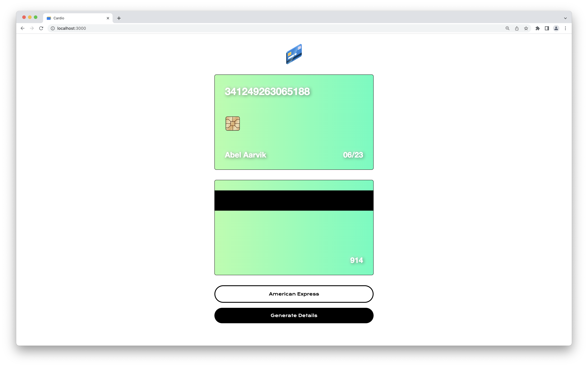
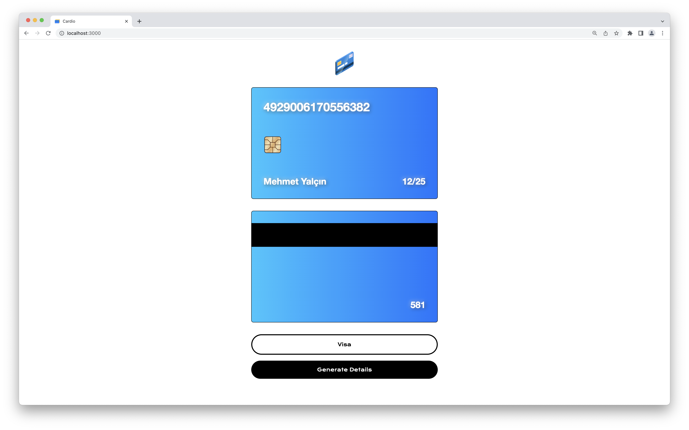

  

# Cardio
This ReactJS application generates aesthetically pleasing credit cards with random names, numbers, and gradients using several public APIs. The credit card numbers are all valid (although they won't work because they aren't connected to any accounts, and their security keys aren't known).

Users may choose to generate either Visa, Discover, American Express, or MasterCard numbers. You will see an error message if you try to generate without an option selected!

  

  

## Getting Started
Want to play around with this project? Download or clone, enter the directory, use `npm install` to install all required dependencies, and use `npm start` to begin the server!

## Image credentials
<a href="https://www.flaticon.com/free-icons/credit-card">Credit card icon (logo) created by Freepik - Flaticon.</a>
<a href="https://www.flaticon.com/free-icons/credit-card">Credit card icon (favicon) created by creative_designer - Flaticon.</a>